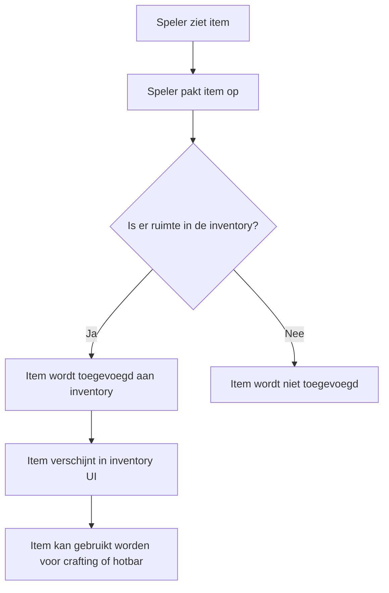
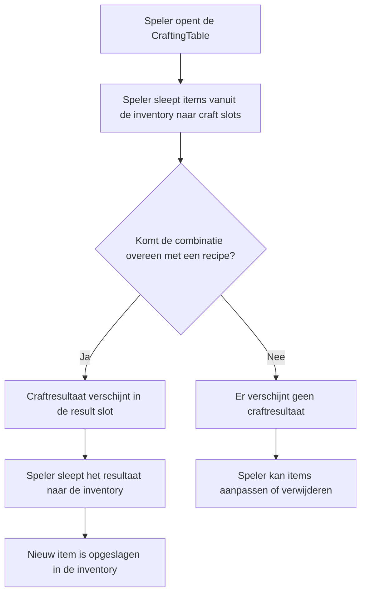
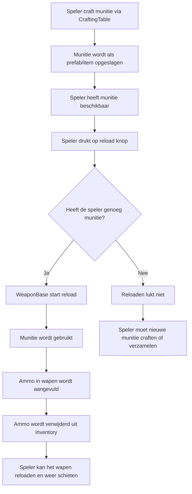
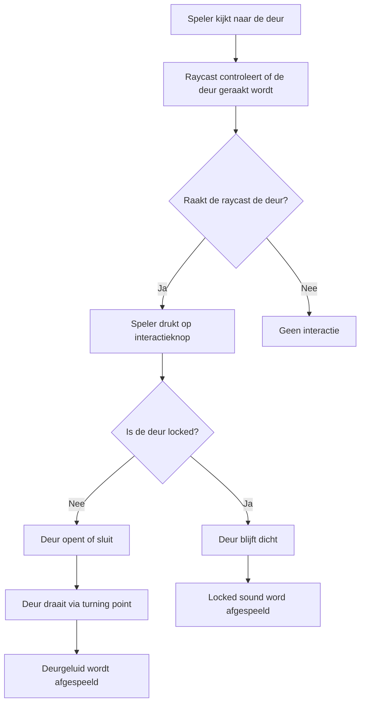

# BO-HLO-Flowchart

```mermaid
flowchart TD
    A[Speler ziet item] --> B[Speler pakt item op]
    B --> C{Is er ruimte in de inventory?}
    C -->|Ja| D[Item wordt toegevoegd aan inventory]
    D --> E[Item verschijnt in inventory UI]
    E --> F[Item kan gebruikt worden voor crafting of hotbar]
    C -->|Nee| G[Item wordt niet toegevoegd]
```

```mermaid
flowchart TD
    A[Speler opent de CraftingTable] --> B[Speler sleept items vanuit de inventory naar craft slots]
    B --> C{Komt de combinatie overeen met een recipe?}
    C -->|Ja| D[Craftresultaat verschijnt in de result slot]
    D --> E[Speler sleept het resultaat naar de inventory]
    E --> F[Nieuw item is opgeslagen in de inventory]
    C -->|Nee| G[Er verschijnt geen craftresultaat]
    G --> H[Speler kan items aanpassen of verwijderen]
```

```mermaid
flowchart TD
     A[Speler craft munitie via CraftingTable] --> B[Munitie wordt als prefab/item opgeslagen]
    B --> C[Speler heeft munitie beschikbaar]
    C --> D[Speler drukt op reload knop]
    D --> E{Heeft de speler genoeg munitie?}

    E -->|Ja| F[WeaponBase start reload]
    F --> G[Munitie wordt gebruikt]
    G --> H[Ammo in wapen wordt aangevuld]
    H --> I[Ammo wordt verwijderd uit inventory]
    I --> J[Speler kan het wapen reloaden en weer schieten]

    E -->|Nee| K[Reloaden lukt niet]
    K --> L[Speler moet nieuwe munitie craften of verzamelen]
```

```mermaid
flowchart TD
 A[Speler kijkt naar de deur] --> B[Raycast controleert of de deur geraakt wordt]
    B --> C{Raakt de raycast de deur?}

    C -->|Ja| D[Speler drukt op interactieknop]
    D --> E{Is de deur locked?}

    E -->|Nee| F[Deur opent of sluit]
    F --> G[Deur draait via turning point]
    G --> H[Deurgeluid wordt afgespeeld]

    E -->|Ja| I[Deur blijft dicht]
    I --> J[Locked sound word afgespeeld]

    C -->|Nee| K[Geen interactie]

     
```

